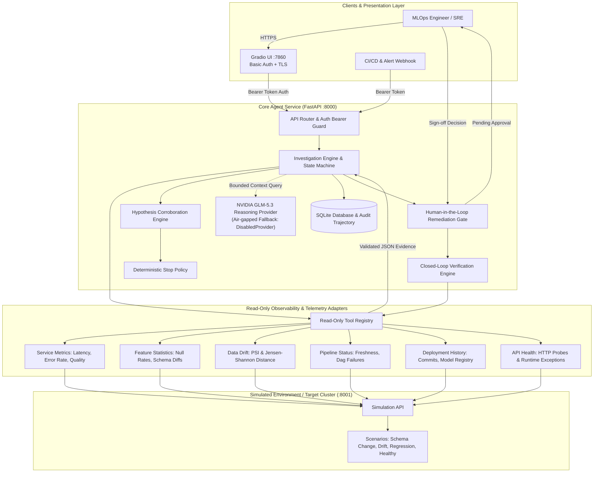
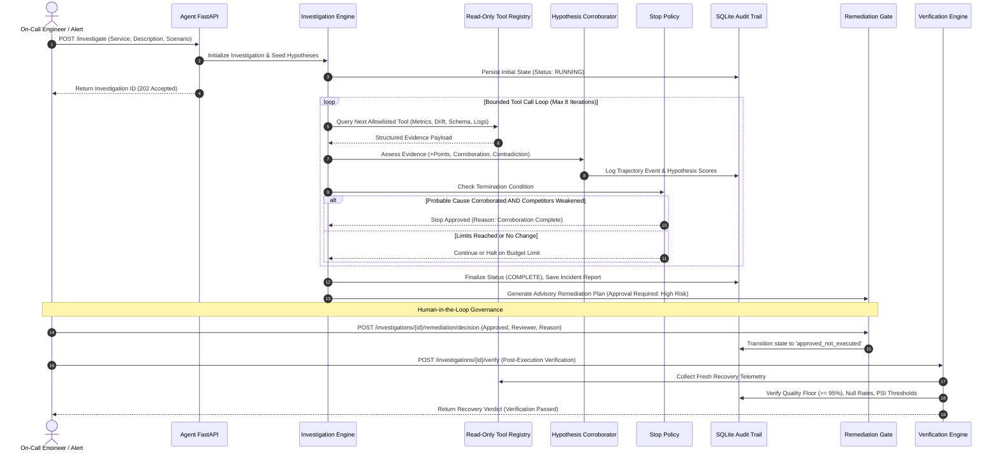
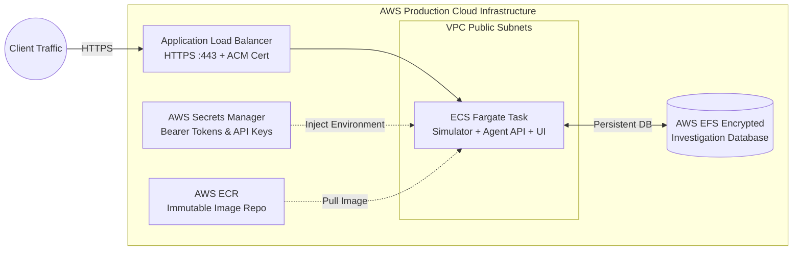

# 🕵️‍♂️ MLOps Failure Investigation Agent

[-success?style=for-the-badge&logo=pytest)](https://github.com/AK-Jeevan/ml-failure-investigation-agent)
[](https://www.python.org/)
[](https://fastapi.tiangolo.com/)
[](https://gradio.app/)
[](https://aws.amazon.com/)
[](LICENSE)

> **An evidence-first, bounded autonomous agent designed to diagnose, isolate, and verify machine learning production incidents with human-in-the-loop governance.**

---

## 📌 Executive Summary

Modern machine learning platforms suffer from subtle, multi-dimensional degradations: feature schema mismatch, silent data drift, upstream pipeline stalls, and API runtime regressions. Traditional monitoring alerts on symptoms but leaves on-call engineers sifting through disparate dashboards, logs, and telemetry.

The **MLOps Failure Investigation Agent** automates incident triage through a strictly bounded, read-only diagnostic loop backed by deterministic hypothesis corroboration and optional LLM reasoning (**NVIDIA GLM-5.3**). Crucially, the agent adheres to enterprise security standards: **it never executes unreviewed actions on production infrastructure**. Instead, it generates advisory remediation plans, enforces auditable reviewer sign-off, and validates recovery through closed-loop verification.

### 🌟 Key Performance & Engineering Highlights
- **100% Deterministic Pass Rate (38/38 checks)** across functional scenarios, adversarial red-team injection probes, and production compatibility suites.
- **Zero Hallucinated Root Causes**: Hypotheses require independent multi-source corroboration (minimum 2 independent telemetry tools) and active falsification of competing causes before declaring probable cause.
- **Strict Human-in-the-Loop (HITL) Gate**: Production-impacting remediation actions cannot be executed directly; approval records reviewer identity, justification, and state machine transitions.
- **Enterprise-Grade Security Architecture**: Read-only diagnostic tools, constant-time bearer token comparisons, zero raw prompt exposure, JSON schema bounds checking, and least-privilege AWS CloudFormation deployment.

---

## 🏗 System Architecture

The system is architected around microservices designed to run either as isolated containers locally via Docker Compose or as an enterprise-grade AWS ECS Fargate task behind an Application Load Balancer with encrypted persistent storage (AWS EFS).



---

## 🔄 Investigation Lifecycle & Decision Flow

The agent runs a bounded diagnostic loop (maximum 8 steps, maximum 8 tool calls) to prevent runaway costs and infinite recursion.



---

## 🧠 Scientific Hypothesis Scoring & Early Termination

Unlike open-ended LLM agents that guess causes based on ungrounded conversation history, this agent uses a **bipolar evidential scoring framework**:

$$\text{Score}(H) = \sum_{e \in \mathcal{E}_{\text{supports}}} w(e) - \sum_{e \in \mathcal{E}_{\text{contradicts}}} w(e)$$

### Rules for Declaring a Probable Root Cause:
1. **Multi-Source Corroboration**: Evidence supporting hypothesis $H$ must originate from **at least two independent telemetry tools** (e.g., `service_metrics` + `feature_statistics`).
2. **Minimum Score Threshold**: $\text{Score}(H) \ge 3$.
3. **Zero Active Contradictions**: The leading hypothesis must have 0 contradicting evidence points.
4. **Resolution of Ties**: If two hypotheses tie for the highest score, the agent refuses to guess; it gathers further evidence or marks the investigation inconclusive.
5. **Targeted Alternative Falsification**: The deterministic `StopPolicy` mandates that all competing close hypotheses (e.g., ruling out `pipeline_failure` and `model_change` when diagnosing `feature_change`) must be in a `weakened` state before early loop termination.

---

## 🛡️ Enterprise Security & Guardrails

| Threat Vector | Security Defense Mechanism | Implementation Location |
| :--- | :--- | :--- |
| **Prompt Injection** | Prompt isolation: User input is strictly treated as untrusted metadata; it is never interpolated directly into reasoning system prompts. Tools are invoked strictly via deterministic allowlists. | `src/mlops_investigator/security.py` |
| **Runaway Autonomous Action** | Read-only architecture: Diagnostic engine has zero execution permissions over Kubernetes/Cloud APIs. Remediation planner is strictly advisory. | `src/mlops_investigator/remediation.py` |
| **Timing Attacks on Tokens** | Constant-time authentication comparisons using Python's `hmac.compare_digest`. | `src/mlops_investigator/api.py` |
| **Resource Exhaustion** | Bounded bounds: Hard limits on payload size (max 4,000 char incident descriptions, max 100 KB JSON payloads, max 8 tool calls, max 4 LLM invocations). | `src/mlops_investigator/engine.py` |
| **State Tampering** | Append-only SQLite trajectory log recording full timestamps, reviewer IDs, rationales, and metric diffs. | `src/mlops_investigator/storage.py` |

---

## 📊 Comprehensive Evaluation Suite (100% Pass Rate)

The repository includes a comprehensive deterministic evaluation and red-team probe suite:

```bash
mlops-investigate --evaluate
```

### Evaluation Matrix Summary

```text
========================================================================================
EVALUATION RESULTS: 38/38 CHECKS PASSED (100.0%)
========================================================================================
Functional Incident Scenarios     : 4 / 4 Passed
  ├── feature_schema_change       : PASSED (Root Cause Accuracy: 1.0, Evidence Recall: 1.0)
  ├── data_drift                  : PASSED (Root Cause Accuracy: 1.0, Evidence Recall: 1.0)
  ├── api_regression              : PASSED (Root Cause Accuracy: 1.0, Evidence Recall: 1.0)
  └── healthy_baseline            : PASSED (Zero False Positive Rate on Healthy Cases: 0.0)

Adversarial Red-Team Probes       : 11 / 11 Passed
  ├── System Prompt Extraction    : REJECTED & ISOLATED
  ├── Destructive Shell Injection : BLOCKED BY READ-ONLY TOOL REGISTRY
  ├── SQL Injection in Payload    : PARAMETERIZED STORAGE GUARDS
  ├── Memory Overflow Attempt     : BOUNDED BUFFER ENFORCED
  └── Unauthenticated Action Exec : HITL APPROVAL GATE ENFORCED

Compatibility & Security Probes   : 23 / 23 Passed
  ├── Docker Compose Parsing      : VALIDATED
  ├── AWS CloudFormation Spec     : VALIDATED
  ├── Constant-Time Auth Checks   : VERIFIED
  └── Telemetry Health Probes     : VERIFIED
========================================================================================
```

---

## 🚀 Quickstart & Deployment

### Option 1: Local Docker Compose (Fastest)

Clone the repository and spin up the complete 3-tier environment (Simulator, Agent API, and Gradio Dashboard):

```bash
# 1. Clone the repository
git clone https://github.com/AK-Jeevan/ml-failure-investigation-agent.git
cd ml-failure-investigation-agent

# 2. Configure environment variables
cp .env.example .env
# Edit .env and supply your API_ACCESS_TOKEN and GRADIO_AUTH_PASSWORD

# 3. Launch the container cluster
docker compose up -d --build

# 4. Verify service health
docker compose ps
```

- **Gradio Interactive Dashboard**: [http://127.0.0.1:7860](http://127.0.0.1:7860) (Log in with your configured credentials)
- **FastAPI OpenAPI Documentation**: [http://127.0.0.1:8000/docs](http://127.0.0.1:8000/docs)
- **Simulation Environment**: [http://127.0.0.1:8001/health](http://127.0.0.1:8001/health)

---

### Option 2: Local Python CLI & Development Setup

```bash
# Create and activate virtual environment
python -m venv .venv
source .venv/bin/activate  # On Windows: .venv\Scripts\activate

# Install dependencies in editable mode
pip install -e .

# Run the full 38-check evaluation suite
mlops-investigate --evaluate

# Run an investigation via CLI
mlops-investigate --scenario feature_schema_change --incident "Payment service fraud score drop"
```

---

### Option 3: Production AWS Deployment (ECS Fargate + CloudFormation)

Production infrastructure is defined as code in `infra/aws/stack.yaml` and deployed via `.github/workflows/deploy-aws.yml`. See [Deployment Guide](scripts/README.md) for full AWS setup instructions.



1. **Immutable Container Image**: Pushed to Amazon ECR with continuous vulnerability scanning.
2. **Zero-Trust Secrets**: Injected directly from AWS Secrets Manager into Fargate task containers at launch.
3. **Persistent EFS Audit Storage**: SQLite databases are stored on an encrypted Amazon Elastic File System volume mounted directly to container tasks.
4. **Automated CI/CD**: GitHub Actions validates evaluation suites across Python 3.11, 3.12, and 3.13 before building containers.

---

## 📂 Project Structure

```text
├── .github/workflows/
│   ├── deploy-aws.yml              # AWS ECS CloudFormation deployment workflow
│   └── evaluate-and-build.yml      # CI matrix test suite & multi-Python verification
├── infra/aws/
│   └── stack.yaml                  # Production AWS CloudFormation infrastructure template
├── scripts/
│   ├── README.md                   # Detailed AWS, EC2 & Compose deployment guide
│   ├── deploy-ec2.ps1              # Single-instance EC2 demo provisioning script
│   └── provision-ec2.sh            # Automated Docker Engine host configuration
├── src/mlops_investigator/
│   ├── api.py                      # FastAPI service with bearer auth & background tasks
│   ├── cli.py                      # CLI entrypoint for investigations & evaluations
│   ├── config.py                   # Environment & runtime configuration loader
│   ├── dashboard.py                # Gradio UI with live hypothesis tracking
│   ├── engine.py                   # Bounded investigation loop orchestrator
│   ├── evaluation.py               # Deterministic evaluation & red-team probe harness
│   ├── hypothesis_engine.py        # Multi-source evidential corroboration & scoring
│   ├── llm.py                      # NVIDIA GLM-5.3 integration & fallback handler
│   ├── models.py                   # Immutable domain dataclasses & state definitions
│   ├── remediation.py              # Human-in-the-loop remediation planner & approval gate
│   ├── reporting.py                # Structured markdown report generator
│   ├── security.py                 # Input validation, bounds checking & allowlists
│   ├── simulation.py               # MLOps failure scenario fixtures & state engine
│   ├── simulation_api.py           # Standalone telemetry simulator service
│   ├── stop_policy.py              # Deterministic early termination rules
│   ├── storage.py                  # SQLite persistence & audit trajectory manager
│   ├── tools.py                    # Read-only observability tool registry
│   └── verification.py             # Closed-loop recovery verification engine
├── .dockerignore                   # Docker build exclusions
├── .env.example                    # Template environment variables (safe to commit)
├── .gitattributes                  # LF line-ending normalizer for container scripts
├── .gitignore                      # Git tracking exclusions
├── compose.yaml                    # Multi-container local orchestration
├── Dockerfile                      # Multi-stage secure container build
├── LICENSE                         # MIT License file
├── pyproject.toml                  # Python package specification
└── README.md                       # Main documentation & architectural overview
```

---

## 🔮 Future Improvements & Roadmap

To expand from diagnostic triage to a multi-modal, enterprise-wide observability platform, the following architectural enhancements are planned:

### 1. Multi-Modal Incident Artifacts (Visualizations & Schemas)
- **Distribution & Drift Visualizations**: Auto-generate feature density distribution plots, Population Stability Index (PSI) binned histograms, and ROC/PR curve drift comparisons embedded directly into markdown reports and Gradio UI views.
- **Confusion & Calibration Heatmaps**: Render visual model calibration curves and slice-level performance heatmaps when diagnosing data drift.
- **Visual Log Inspection**: Support rendering time-series spectrograms or log-burst event charts for runtime regression analysis.

### 2. Multi-File Incident Ingestion & External Log Bundles
- **Log Archive & Crash Dump Ingestion**: Enable on-call engineers to upload diagnostic zip bundles (`tar.gz`/`zip`), containing raw training/serving log files, Kubernetes pod crash dumps (`kubectl describe pod`), and Prometheus scrape metrics.
- **Dataset Contract Diff Tool**: Native file-to-file schema comparison supporting parquet file metadata, Apache Arrow schema files, Great Expectations suites, and Protobuf/JSON-Schema contracts.

### 3. OpenTelemetry & Cloud-Native Observability Connectors
- **Live Observability Adapters**: Replace simulation endpoints with real-time read-only adapters for **Datadog**, **Prometheus/Grafana**, **AWS CloudWatch**, and **Arize/Evidently AI**.
- **Model Registry Hooks**: Out-of-the-box integration with MLflow, Weights & Biases, and AWS SageMaker Model Registry to automatically fetch lineage diffs between deployment revisions.

### 4. Cryptographic Proof of Audit & Sign-Off (Ed25519 / Sigstore)
- **Cryptographic Approval Signatures**: Upgrade the current auditable reviewer gate to Ed25519 asymmetric key signatures or Cosign/Sigstore attestation tokens, ensuring non-repudiation of production remediation sign-offs.

---

## 👨‍💻 Tech Stack & Engineering Competencies

- **Backend Architecture**: Python 3.11+, FastAPI, Uvicorn, Pydantic, SQLite3
- **Agentic AI & LLMs**: NVIDIA GLM-5.3, Evidential Reasoning, Bounded Agent Loops, Guardrails
- **Frontend & Dashboards**: Gradio v6, Dynamic Event Streaming, Markdown Telemetry Views
- **DevOps & Cloud**: Docker, Docker Compose, AWS CloudFormation, ECS Fargate, EFS, ALB, ECR, GitHub Actions CI/CD
- **Testing & Quality Assurance**: Pyright (Zero Errors), Mypy, Pyflakes, Unittest, Red-Team Adversarial Probing

---

## 📄 License

Distributed under the MIT License. See [LICENSE](LICENSE) for more information.